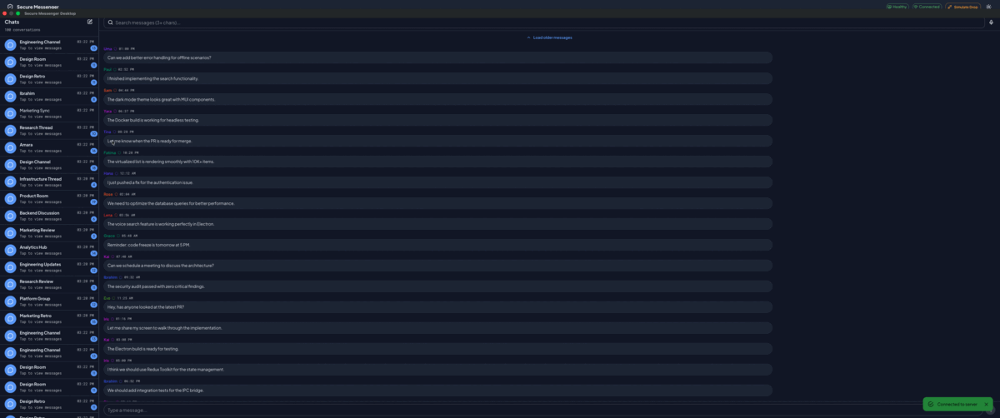
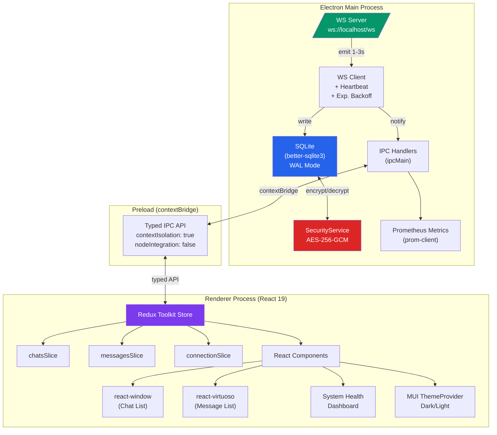
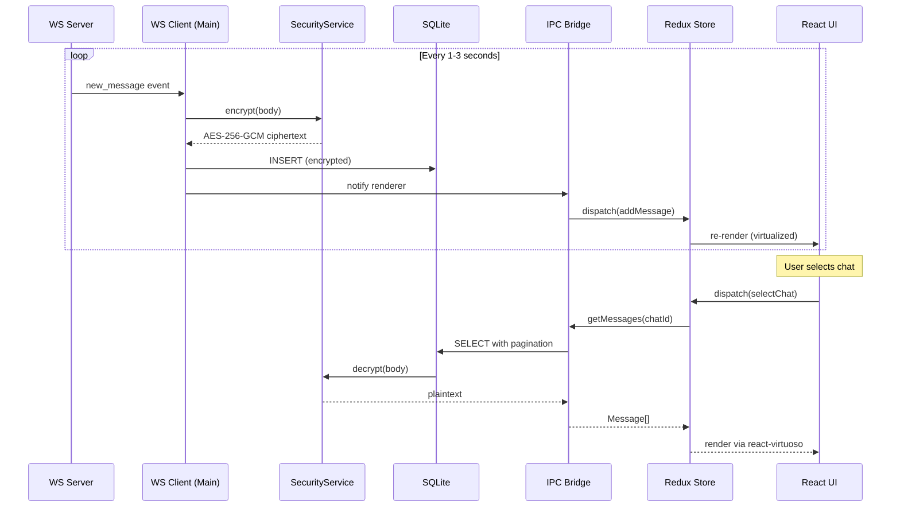
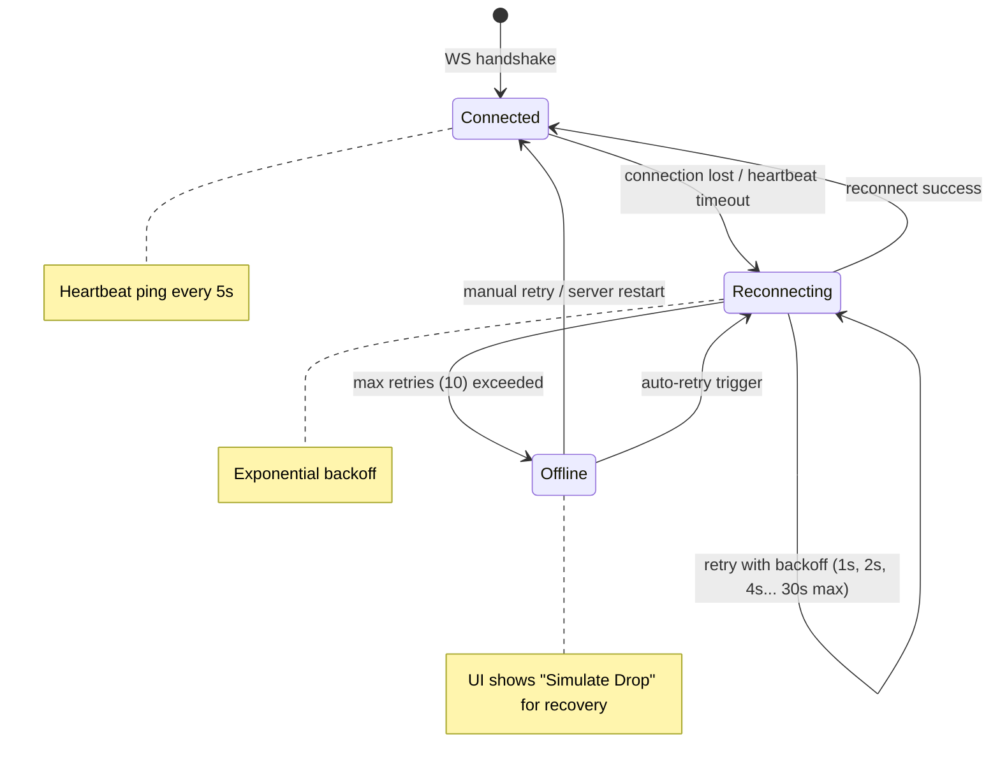
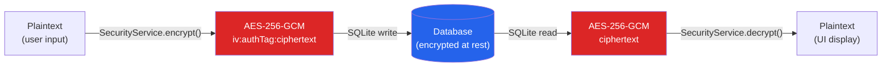

# Secure Messenger Desktop — Chat List + Sync Simulator

[](https://github.com/ericgitangu/secure-messenger-desktop/actions/workflows/ci.yml)
[](https://secure-messenger-desktop.fly.dev/)
[]()
[](https://www.typescriptlang.org/)
[](https://www.electronjs.org/)
[](https://react.dev/)
[](https://redux-toolkit.js.org/)
[](https://www.sqlite.org/)
[]()
[](https://docs.docker.com/compose/)
[](https://prometheus.io/)
[](https://grafana.com/)
[](https://pnpm.io/)
[](LICENSE)

> Technical assessment: Electron + React + TypeScript secure messenger client with real-time sync, virtualized lists, and AES-256-GCM encryption.

**Time-boxed:** ~4 hours. See [What Remains](#what-id-improve-with-more-time) for documented future work.

### Live Demo

**[secure-messenger-desktop.fly.dev](https://secure-messenger-desktop.fly.dev/)** — Browser mode deployed on Fly.io (Frankfurt region). Same React UI as the native Electron app, powered by Express + WebSocket on a single port.

**[Try it now →](https://secure-messenger-desktop.fly.dev/)**

- Create new chats (pen icon in sidebar)
- Send messages (input bar at bottom)
- Watch real-time streaming messages arrive
- Click the **System Health** indicator in the header to see the built-in monitoring dashboard with live Prometheus metrics, charts, and resource usage

### App Walkthrough



---

## Candidate

**Eric Gitangu** | Senior Software Engineer Architect | 10+ years

|           |                                                                |
| --------- | -------------------------------------------------------------- |
| Email     | developer.ericgitangu@gmail.com                                |
| Phone     | +1 (978) 710-9475 (US) \| +254 708 078997 (KE)                 |
| Portfolio | [developer.ericgitangu.com](https://developer.ericgitangu.com) |
| Resume    | [resume.ericgitangu.com](https://resume.ericgitangu.com)       |
| GitHub    | [github.com/ericgitangu](https://github.com/ericgitangu)       |

---

## Quick Start

```bash
git clone https://github.com/ericgitangu/secure-messenger-desktop.git
cd secure-messenger-desktop
pnpm install
pnpm dev          # Launch Electron app (auto-rebuilds native modules)
pnpm test         # Run 81 tests (auto-rebuilds native modules for Node.js)
pnpm lint         # ESLint (strict: no-any, React perf rules)
pnpm make         # Build for production (macOS/Windows/Linux)
```

### Web Mode (Browser)

```bash
pnpm server:dev   # Vite dev server + Express API — open http://localhost:3000
```

### Docker (Full Stack with Observability)

**Prerequisites:**

- [Docker Desktop](https://www.docker.com/products/docker-desktop/) (v4.x+) or Docker Engine (v24+) with Compose V2
- At least 4 GB RAM allocated to Docker
- macOS, Windows (WSL2), or Linux

```bash
# Launch the full web stack (app + Prometheus + Grafana)
docker compose up --build

# Tear down
docker compose down --volumes --remove-orphans

# Run tests / lint in containers
docker compose run test
docker compose run lint
```

**Access URLs:**

| Service       | URL                           | Credentials   |
| ------------- | ----------------------------- | ------------- |
| Messenger UI  | http://localhost:3000         | —             |
| WebSocket     | ws://localhost:3000/ws        | —             |
| Prometheus    | http://localhost:9090         | —             |
| Grafana       | http://localhost:3001         | admin / admin |
| Metrics (raw) | http://localhost:3000/metrics | —             |
| Swagger UI    | http://localhost:3000/swagger | —             |

**Architecture:**

```
Browser → :3000 (Express: React SPA + REST API + WebSocket /ws)

Prometheus :9090 → scrapes :3000/metrics every 5s
Grafana :3001 → queries Prometheus → "Secure Messenger" dashboard
```

The same React UI works in both **Electron** (native desktop via IPC) and **Browser** (Docker/web via fetch + WebSocket) modes, powered by a runtime bridge abstraction that detects the environment and returns the correct `ElectronAPI` implementation.

### Full Stack Native Mode (Electron + Observability)

Run the native Electron desktop app with Prometheus + Grafana observability:

```bash
pnpm start:full   # Starts Docker services + Electron in one command
```

This will:

1. Check if the web build is up to date (rebuilds if source changed)
2. Start Prometheus (:9090) and Grafana (:3001) in Docker
3. Wait for services to be healthy
4. Launch the native Electron app with an embedded Express server (:3000/metrics)

Prometheus scrapes metrics from the Electron main process via `host.docker.internal:3000`. Grafana dashboards show the same panels as Docker-only mode.

**Manual control:**

```bash
pnpm docker:native        # Start just the Docker services (Prometheus + Grafana)
pnpm dev                  # Start just Electron (with embedded Express on :3000)
pnpm docker:native:down   # Stop the Docker services
```

### All Available Scripts

| Script               | Description                                                      |
| -------------------- | ---------------------------------------------------------------- |
| `pnpm dev`           | Launch native Electron app (auto-rebuilds native modules)        |
| `pnpm start:full`    | Electron + Prometheus + Grafana (full stack)                     |
| `pnpm server:dev`    | Browser mode: Vite dev + Express API                             |
| `pnpm build:web`     | Build SPA + server for production                                |
| `pnpm docker:up`     | Docker Compose: app + Prometheus + Grafana                       |
| `pnpm docker:down`   | Tear down Docker stack                                           |
| `pnpm docker:native` | Start only Prometheus + Grafana in Docker                        |
| `pnpm test`          | Run 81 tests (auto-rebuilds native modules for Node.js)          |
| `pnpm test:coverage` | Run tests with Istanbul/V8 coverage report                       |
| `pnpm lint`          | ESLint (strict: no-any, React perf rules)                        |
| `pnpm make`          | Build platform binaries (macOS/Windows/Linux via Electron Forge) |

### Git Hooks

| Hook            | What it does                                                        |
| --------------- | ------------------------------------------------------------------- |
| **pre-commit**  | lint-staged + gitleaks + TypeScript type check                      |
| **commit-msg**  | Conventional commit validation                                      |
| **post-commit** | Fast test run                                                       |
| **pre-push**    | Detects changed files, rebuilds web artifacts if needed, runs tests |

The **pre-push** hook ensures pushed code always has up-to-date build artifacts. It diffs against the upstream branch, and if `src/`, config, or Docker files changed, it triggers the appropriate rebuilds before allowing the push.

### CI/CD Pipeline

The [GitHub Actions workflow](.github/workflows/ci.yml) runs on every push and PR to `main`:

```
Lint → Test (+ JUnit XML + coverage) → Build (macOS, Windows, Linux)
```

| Job     | Runs on         | Produces                                                                  |
| ------- | --------------- | ------------------------------------------------------------------------- |
| `lint`  | ubuntu-latest   | Pass/fail (ESLint strict: no-any, React perf rules)                       |
| `test`  | ubuntu-latest   | `test-results` artifact (JUnit XML) + `coverage` artifact (Istanbul JSON) |
| `build` | matrix (3 OSes) | `build-ubuntu-latest`, `build-macos-latest`, `build-windows-latest`       |

All test and coverage artifacts are generated in the pipeline and downloadable from the **Actions** tab — they are **not committed** to the repo. This keeps the repository clean and ensures artifacts always reflect the latest code.

---

## Architecture



### Data Flow



### Connection State Machine



---

## Technical Decisions & Trade-offs

| Decision                   | Choice                         | Rationale                                                                                                                                       |
| -------------------------- | ------------------------------ | ----------------------------------------------------------------------------------------------------------------------------------------------- |
| **Database**               | `better-sqlite3`               | Synchronous C++ binding — 5-10x faster than sql.js (WASM). WAL mode for concurrent reads. Sync I/O in main process doesn't block renderer.      |
| **Encryption**             | AES-256-GCM (Node.js `crypto`) | Authenticated encryption — 96-bit random IV per message, 128-bit auth tag for tamper detection. Production path: Signal Protocol via libsignal. |
| **State Management**       | Redux Toolkit                  | Assessment requires Redux. `createSlice` maps cleanly to connection state machine. RTK DevTools for debugging.                                  |
| **Chat Virtualization**    | `react-window` `FixedSizeList` | Fixed 72px rows, 200 items. Smallest bundle, fastest for uniform rows.                                                                          |
| **Message Virtualization** | `react-virtuoso` `Virtuoso`    | Variable-height bubbles, `startReached` for load-older, `followOutput` for auto-scroll. Purpose-built for chat UX.                              |
| **UI Framework**           | MUI v7 + lucide-react          | Chip (connection), Badge (unread), Snackbar (notifications), Dialog (health modal).                                                             |
| **Typography**             | Plus Jakarta Sans (variable)   | Modern Google Font via @fontsource for offline Electron. Roboto Mono for timestamps.                                                            |
| **WebSocket**              | `ws` (Node-native)             | Lightweight, no browser polyfill needed in main process. Heartbeat + ping built-in.                                                             |
| **Search**                 | Debounced (300ms, 3+ chars)    | In-memory decrypt-then-filter for encrypted bodies. Debounce prevents excessive queries.                                                        |
| **Voice Search**           | Web Speech API (native)        | Zero dependencies. Real-time transcript. Adapted from production system.                                                                        |
| **Metrics**                | `prom-client` + recharts       | Prometheus-compatible counters/histograms in main process. Recharts for Grafana-like dashboard.                                                 |
| **Package Manager**        | pnpm                           | Faster installs, strict node_modules, disk-efficient content-addressable store.                                                                 |

---

## SQLite Schema & Optimization

### Schema

```sql
CREATE TABLE chats (
  id TEXT PRIMARY KEY,
  title TEXT NOT NULL,
  lastMessageAt INTEGER NOT NULL,
  unreadCount INTEGER DEFAULT 0
);

CREATE TABLE messages (
  id TEXT PRIMARY KEY,
  chatId TEXT NOT NULL,
  ts INTEGER NOT NULL,
  sender TEXT NOT NULL,
  body TEXT NOT NULL,  -- AES-256-GCM encrypted
  FOREIGN KEY (chatId) REFERENCES chats(id)
);
```

### Indexes & Query Optimization

| Index                                         | Query Pattern               | EXPLAIN QUERY PLAN                                                     |
| --------------------------------------------- | --------------------------- | ---------------------------------------------------------------------- |
| `idx_chats_last_message (lastMessageAt DESC)` | Chat list pagination        | `SCAN chats USING INDEX idx_chats_last_message`                        |
| `idx_messages_chat_ts (chatId, ts DESC)`      | Message pagination per chat | `SEARCH messages USING INDEX idx_messages_chat_ts (chatId=? AND ts<?)` |
| `idx_messages_body (body)`                    | Full-body match (encrypted) | Used for exact-match lookups on encrypted bodies                       |

**Normalization:** Two-table design (chats + messages) in 3NF. `chatId` FK enforces referential integrity. No denormalization needed at this scale.

**Pagination:** Cursor-based using `ts < ?` (keyset pagination) instead of `OFFSET` — avoids full table scans on large datasets. Chat list uses offset pagination since the dataset is bounded (200 chats).

**WAL Mode:** Enabled for concurrent reads. Allows the renderer to query while the main process writes new messages from WebSocket.

**Lazy Loading:** Messages load on-demand when a chat is selected (last 50). "Load older" fetches the next page using cursor-based pagination. Chat list fetches in pages of 50.

---

## Security Design

### AES-256-GCM Encryption Boundary



**Implementation details:**

- **Algorithm:** AES-256-GCM (authenticated encryption with associated data)
- **Key:** 256-bit, generated via `crypto.randomBytes(32)` on first launch
- **IV:** 96-bit random per encryption (NIST SP 800-38D recommendation)
- **Auth Tag:** 128-bit for tamper detection
- **Key Storage:** `{userData}/.encryption-key` with `0600` permissions (owner read/write only)
- **Format:** `base64(iv:authTag:ciphertext)` — all components base64-encoded

**Production upgrade path:**

1. Hardware-backed keystore (macOS Keychain, Windows DPAPI, Linux Secret Service)
2. Signal Protocol via `libsignal-client` for E2E encryption
3. X3DH key exchange + Double Ratchet for forward secrecy

**No plaintext leaks:**

- No `console.log` of message bodies in codebase
- ESLint rule `no-console` enforces this
- All DB reads go through `SecurityService.decrypt()`
- Tampered ciphertext detected via auth tag verification

### Process Isolation

| Setting            | Value                | Purpose                                                   |
| ------------------ | -------------------- | --------------------------------------------------------- |
| `contextIsolation` | `true`               | Renderer cannot access Node.js APIs                       |
| `nodeIntegration`  | `false`              | No `require()` in renderer                                |
| `sandbox`          | `false`              | Required for preload IPC (production: `true` with worker) |
| IPC                | `contextBridge` only | Typed API contract, no raw `ipcRenderer`                  |

---

## System Health Dashboard & Built-in Monitoring

The header includes a **System Health Indicator** (healthy/degraded/unhealthy) that opens a full Grafana-style monitoring dashboard — **no external tools required**. The dashboard works on the [live Fly.io deployment](https://secure-messenger-desktop.fly.dev/) and locally.

### Client-Side Metrics (Real-time)

| Metric            | Source                          | Visualization                 |
| ----------------- | ------------------------------- | ----------------------------- |
| WebSocket Latency | Bridge round-trip timing        | Line chart + metric card      |
| Database Latency  | Bridge round-trip timing        | Line chart + metric card      |
| IPC Round-trip    | Bridge round-trip timing        | Line chart + metric card      |
| Messages/second   | Redux state delta               | Area chart                    |
| Queries/second    | Local counter delta             | Area chart                    |
| Reconnect Count   | Redux connection state          | Metric card                   |
| Service Status    | Latency thresholds (mode-aware) | Status grid with health chips |

### Server-Side Metrics (Prometheus — Live Polling)

The dashboard polls the `/metrics` endpoint every 5 seconds and visualizes server-side Prometheus data directly in the app:

| Metric                                  | Type      | Visualization                                     |
| --------------------------------------- | --------- | ------------------------------------------------- |
| `messenger_messages_received_total`     | Counter   | Metric card (total)                               |
| `messenger_messages_stored_total`       | Counter   | Metric card (total) + throughput area chart       |
| `messenger_ws_connection_state`         | Gauge     | Status indicator (Connected/Reconnecting/Offline) |
| `messenger_ws_active_connections`       | Gauge     | Metric card (active clients)                      |
| `messenger_encryption_operations_total` | Counter   | Metric card (total encrypt/decrypt ops)           |
| `messenger_db_query_duration_seconds`   | Histogram | Exposed via /metrics for Grafana                  |
| `messenger_ipc_call_duration_seconds`   | Histogram | Exposed via /metrics for Grafana                  |
| `messenger_db_row_count`                | Gauge     | Horizontal bar chart (chats vs messages)          |
| `process_resident_memory_bytes`         | Gauge     | Progress bar (RSS memory)                         |
| `nodejs_heap_size_used_bytes`           | Gauge     | Progress bar (heap usage)                         |
| `nodejs_eventloop_lag_seconds`          | Gauge     | Progress bar (event loop lag)                     |
| `process_cpu_user_seconds_total`        | Counter   | Metric card (CPU time)                            |

### External Grafana (Docker Compose)

For advanced visualization, the Docker Compose stack provides full Prometheus + Grafana:

```bash
docker compose up --build    # App + Prometheus + Grafana
# Open http://localhost:3001 → Dashboards → Secure Messenger
```

12-panel auto-provisioned dashboard with percentile histograms, rate calculations, and Node.js runtime metrics.

### Raw Metrics Endpoint

The `/metrics` endpoint is available on all deployments for external monitoring tools:

| Environment | URL                                              |
| ----------- | ------------------------------------------------ |
| Fly.io      | https://secure-messenger-desktop.fly.dev/metrics |
| Docker      | http://localhost:3000/metrics                    |
| Electron    | http://localhost:3000/metrics                    |

---

## Search Architecture

### Debounced Search

- **Trigger:** After 3+ characters typed, with 300ms debounce
- **Scope:** Current chat or global (all chats)
- **Implementation:** Decrypt-then-filter in memory (required because bodies are encrypted at rest)

### Voice Search

- **API:** Web Speech API (browser-native, zero dependencies)
- **Flow:** Voice → transcript → debounced search pipeline
- **Adapted from:** Production system ([unicorns project](https://github.com/ericgitangu))

### Future: Semantic Search

With more time, semantic search via embeddings:

1. Generate embeddings at write time (before encryption) using a local model
2. Store embeddings in a separate SQLite table (not encrypted — they're not invertible)
3. Vector similarity search using cosine distance
4. FTS5 as intermediate step before full semantic search

---

## Evaluation Criteria — How We Meet Them

### SQLite Usage Quality

- **Indexes:** 3 targeted indexes (`lastMessageAt DESC`, composite `chatId + ts DESC`, `body`)
- **Pagination:** Cursor-based for messages (`ts < ?`), offset-based for bounded chat list
- **No full table loads:** All queries use `LIMIT` + pagination. Search decrypts in-memory but streams results with early termination
- **WAL mode:** Enabled for concurrent read/write
- **Foreign keys:** Enforced with `PRAGMA foreign_keys = ON`

### Connection Reliability

- **State machine:** 3-state (Connected → Reconnecting → Offline) implemented as Redux slice
- **Exponential backoff:** 1s, 2s, 4s, 8s... max 30s, max 10 retries
- **Heartbeat:** Ping every 5s, timeout at 10s
- **Recovery:** "Simulate Drop" button for testing, auto-recovery on server restart

### React Performance

- **Chat list:** `react-window` `FixedSizeList` — renders only visible rows (~8-10 of 200)
- **Message list:** `react-virtuoso` `Virtuoso` — variable height, bi-directional scroll
- **Minimal re-renders:** `React.memo` on ChatRow/MessageBubble, `useCallback` for handlers
- **Debounced search:** 300ms debounce prevents excessive re-renders during typing

### Architecture

- **Module boundaries:** Main process (DB, WS, Security), Preload (IPC bridge), Renderer (React, Redux)
- **Clean data flow:** WS → DB → IPC → Redux → React (unidirectional)
- **Testability:** 80+ tests across unit (DB, store, security), integration (WS), and contract (Pact)
- **Type safety:** Strict TypeScript, ESLint `no-explicit-any: error`, typed IPC contracts

### Security Discipline

- **Encryption:** AES-256-GCM on all message bodies (not a placeholder — real crypto)
- **No leaks:** `no-console` ESLint rule, no plaintext in logs
- **Auth tags:** Tampered ciphertext is detected and rejected
- **Key management:** Per-device key with restrictive file permissions
- **Process isolation:** `contextIsolation: true`, `nodeIntegration: false`

---

## Functional Requirements Checklist

| #   | Requirement                     | Status | Implementation                                                                            |
| --- | ------------------------------- | ------ | ----------------------------------------------------------------------------------------- |
|     | **A) SQLite Local Storage**     |        |                                                                                           |
| 1   | Schema (chats + messages)       | Done   | 2-table 3NF design with FK constraints, composite indexes                                 |
| 2   | Seed 200 chats + 20K messages   | Done   | Transaction-wrapped seeding, idempotent, AES-256-GCM encrypted bodies                     |
| 3   | Chat list with pagination       | Done   | `ORDER BY lastMessageAt DESC LIMIT ? OFFSET ?` + infinite scroll                          |
| 4   | Message pagination              | Done   | Cursor-based `WHERE ts < ? ORDER BY ts DESC LIMIT 50`                                     |
| 5   | Basic search (substring)        | Done   | Debounced (300ms, 3+ chars), decrypt-then-filter, voice search via Web Speech API         |
| 6   | WAL mode + indexes              | Done   | WAL for concurrent reads, 3 targeted indexes (see [Schema](#sqlite-schema--optimization)) |
|     | **B) WebSocket Sync**           |        |                                                                                           |
| 7   | Real-time message streaming     | Done   | `ws` server emits every 1-3s, single-port `/ws` path in web mode                          |
| 8   | Event format                    | Done   | `{ chatId, messageId, ts, sender, body }` — validated by Pact contract tests              |
| 9   | Write to DB + update UI         | Done   | WS Client → encrypt → SQLite → IPC → Redux → Virtuoso (unidirectional flow)               |
|     | **C) Connection Health**        |        |                                                                                           |
| 10  | 3-state connection machine      | Done   | Connected → Reconnecting → Offline, implemented as Redux slice                            |
| 11  | Visual state indicator          | Done   | MUI Chip with color-coded icons (Wifi/WifiOff/Loader2)                                    |
| 12  | Heartbeat monitoring            | Done   | Ping every 5s, timeout at 10s, auto-reconnect on failure                                  |
| 13  | Exponential backoff             | Done   | 1s → 2s → 4s → 8s → ... → 30s max, 10 retries max                                         |
| 14  | Simulate disconnect             | Done   | Header button terminates all WS connections for testing recovery                          |
|     | **D) UI Performance**           |        |                                                                                           |
| 15  | Chat list virtualization        | Done   | `react-window` `FixedSizeList` — renders only visible rows (~8-10 of 200)                 |
| 16  | Message list virtualization     | Done   | `react-virtuoso` `Virtuoso` — variable height, bi-directional scroll, `followOutput`      |
| 17  | Unread count + mark read        | Done   | MUI Badge component, auto-mark on chat selection                                          |
| 18  | Load older messages             | Done   | "Load older" button + `startReached` callback in Virtuoso                                 |
| 19  | Minimal re-renders              | Done   | `React.memo` on ChatRow/MessageBubble, `useCallback` + `useMemo` throughout               |
|     | **E) User Actions**             |        |                                                                                           |
| 20  | Create new chat                 | Done   | Compose button (pen icon) in sidebar → inline TextField → Enter to create                 |
| 21  | Send message in chat            | Done   | Input bar + send button at bottom of message view, Enter to send                          |
| 22  | Messages encrypted on send      | Done   | User-sent messages are AES-256-GCM encrypted before SQLite storage                        |
|     | **F) Security**                 |        |                                                                                           |
| 23  | AES-256-GCM encryption          | Done   | 256-bit key, 96-bit IV, 128-bit auth tag — real crypto, not a placeholder                 |
| 24  | Tamper detection                | Done   | GCM auth tag verification, tampered ciphertext is rejected                                |
| 25  | Process isolation               | Done   | `contextIsolation: true`, `nodeIntegration: false`, typed `contextBridge` only            |
| 26  | No plaintext leaks              | Done   | `no-console` ESLint rule, all DB reads through `SecurityService.decrypt()`                |
|     | **G) Observability**            |        |                                                                                           |
| 27  | System health dashboard         | Done   | Header indicator → click-to-expand Grafana-style modal with two-tier monitoring           |
| 28  | Prometheus metrics              | Done   | `prom-client` counters, histograms, gauges — instrumented across WS, DB, encryption       |
| 29  | Built-in metrics visualization  | Done   | Polls `/metrics` endpoint live; renders counters, bar charts, area charts, progress bars  |
| 30  | Grafana dashboards (Docker)     | Done   | 12-panel auto-provisioned dashboard via Docker Compose                                    |
| 31  | Real-time charts                | Done   | Recharts latency + throughput + server throughput + DB row counts, mode-aware thresholds  |
|     | **H) Testing**                  |        |                                                                                           |
| 31  | Unit tests                      | Done   | 63 tests: Security (16), DB queries (19), DB seed (7), Redux slices (21)                  |
| 32  | Integration tests               | Done   | 4 tests: WS Server → Client → SQLite round-trip                                           |
| 33  | Contract tests                  | Done   | 14 Pact tests: WS event schema validation, discriminated unions                           |
| 34  | CI/CD pipeline                  | Done   | GitHub Actions: Lint → Test (JUnit XML + coverage) → Build (macOS/Windows/Linux)          |
|     | **I) DevOps & Deployment**      |        |                                                                                           |
| 35  | Docker Compose full stack       | Done   | App + Prometheus + Grafana, single `docker compose up`                                    |
| 36  | Fly.io live deployment          | Done   | [secure-messenger-desktop.fly.dev](https://secure-messenger-desktop.fly.dev/)             |
| 37  | Automated native module rebuild | Done   | `scripts/ensure-native.sh` with lifecycle hooks (predev/pretest/premake)                  |
| 38  | Git hooks (pre-commit/pre-push) | Done   | lint-staged + gitleaks + tsc + commitlint + test + auto-rebuild                           |
| 39  | Dependabot                      | Done   | Automated pnpm dependency updates via `.github/dependabot.yml`                            |

---

## API Documentation

The IPC API is documented in OpenAPI 3.0 format:

- **Live:** [secure-messenger-desktop.fly.dev/swagger](https://secure-messenger-desktop.fly.dev/swagger) — interactive Swagger UI
- **Spec:** [`src/docs/openapi.yaml`](src/docs/openapi.yaml)
- **Endpoints:** 6 IPC handlers + 2 WebSocket event types
- **Schemas:** Chat, Message, NewMessageEvent, ConnectionState

---

## Build Issues Encountered & Solutions

During the 4-hour assessment, several build/runtime issues were identified and resolved:

### 1. pnpm + Electron Forge: `node-linker` error

**Problem:** Electron Forge requires hoisted `node_modules` for native module resolution, but pnpm uses symlinked stores by default.

```
Error: node-linker must be set to "hoisted" when using Electron Forge with pnpm
```

**Fix:** Created `.npmrc` with `node-linker=hoisted` and `shamefully-hoist=true`, then reinstalled.

### 2. Vite ESM/CJS conflict: `@vitejs/plugin-react`

**Problem:** `@vitejs/plugin-react` ships as ESM-only, but electron-forge's esbuild pipeline loaded `.ts` configs as CJS via `require()`.

```
Error: "@vitejs/plugin-react" resolved to an ESM file. ESM file cannot be loaded by require()
```

**Fix:** Renamed all Vite config files from `.ts` → `.mts` (explicit ESM module extension). Updated `forge.config.ts` references. Replaced `__dirname` (CJS-only) with `path.dirname(fileURLToPath(import.meta.url))`.

### 3. ws `bufferutil` optional dependency

**Problem:** Vite tried to bundle the `ws` library (used in Electron main process), which optionally imports native C++ addons `bufferutil` and `utf-8-validate`. These aren't installed and shouldn't be bundled.

```
Error: Could not resolve "bufferutil" imported by "ws". Is it installed?
```

**Fix:** Added `ws`, `bufferutil`, `utf-8-validate`, `prom-client`, and all Node.js built-in modules to `rollupOptions.external` in `vite.main.config.mts`. The main process runs in Node.js — native modules should be resolved at runtime, not bundled.

---

## Deployment

### Fly.io (Production)

The app is deployed to Fly.io Frankfurt region as a single-container service:

```bash
flyctl deploy          # Deploy from local (uses Dockerfile)
```

| URL                                                                           | Purpose               |
| ----------------------------------------------------------------------------- | --------------------- |
| [secure-messenger-desktop.fly.dev](https://secure-messenger-desktop.fly.dev/) | React SPA + REST API  |
| `wss://secure-messenger-desktop.fly.dev/ws`                                   | WebSocket (same port) |
| [Swagger UI](https://secure-messenger-desktop.fly.dev/swagger)                | OpenAPI docs          |

The WebSocket server attaches to the HTTP server on the `/ws` path, enabling single-port deployments compatible with Fly.io, Render, Railway, and other PaaS providers.

### Automated Native Module Rebuild

`better-sqlite3` is a native C++ addon that must be compiled for the correct runtime:

- **Electron** uses `NODE_MODULE_VERSION 143` (Node 22 fork)
- **Node.js** uses `NODE_MODULE_VERSION 141`

The `scripts/ensure-native.sh` script tracks the current build target via a marker file (`node_modules/.native-target`) and only rebuilds when switching targets:

```bash
# Automatic via lifecycle scripts — no manual intervention needed:
pnpm dev          # → predev rebuilds for Electron
pnpm test         # → pretest rebuilds for Node.js
pnpm make         # → premake rebuilds for Electron
```

---

## What I'd Improve With More Time

1. **FTS5 full-text search** — Replace decrypt-then-filter with SQLite FTS5 for sub-ms search
2. **Semantic search** — Local embeddings for natural language queries
3. **Signal Protocol** — `libsignal-client` for E2E encryption with Double Ratchet
4. **Hardware keystore** — macOS Keychain / Windows DPAPI for key storage
5. **Offline message queue** — SQLite outbox table, sync on reconnect with vector clocks
6. **E2E tests** — Playwright for full UI automation
7. **Message reactions & threads** — Rich message model
8. **File sharing** — Encrypted attachments with thumbnails
9. **Auto-updater** — Squirrel-based updates via electron-forge
10. **i18n** — i18next for multi-language support
11. ~~**Swagger UI**~~ — Done: live at `/swagger`

---

## Beyond the Requirements

### Create Chat & Send Message (Full End-to-End)

Both features are wired through the entire stack — not just UI stubs:

```
UI Component → Redux Thunk → Bridge API → IPC/HTTP → DB Query → SQLite
```

- **Create chat:** Compose button (pen icon) in sidebar header → inline text field → `POST /api/chats` → Redux unshifts new chat to list
- **Send message:** Input bar at bottom of message view → `POST /api/messages` → AES-256-GCM encrypt → SQLite INSERT → chat list re-sorts by `lastMessageAt`
- Both work identically in Electron (IPC) and browser (REST API) modes via the bridge abstraction

### AES-256-GCM Encryption (Real, Not Placeholder)

- 256-bit key, 96-bit random IV, 128-bit auth tag per message
- Tamper detection via GCM authentication — tampered ciphertext rejected
- User-sent messages are encrypted before storage (same path as streaming messages)
- 16 security-specific tests including wrong-key, tamper detection, unicode, and batch operations

### Built-in Monitoring Dashboard (No External Tools Required)

- Header indicator (Healthy/Degraded/Unhealthy) with click-to-expand Grafana-style modal
- **Two-tier monitoring:** Client-side latency/throughput charts + live server-side Prometheus metrics
- Server metrics section polls `/metrics` every 5s and renders: message counters, DB row counts (bar chart), server throughput (area chart), resource usage (progress bars for memory, heap, event loop lag)
- **Mode-aware thresholds:** Electron IPC (<50ms DB, <200ms IPC) vs web mode (<500ms DB, <800ms IPC)
- Works on the **live Fly.io deployment** — no Grafana/Prometheus infrastructure needed
- Full Grafana + Prometheus stack available via Docker Compose for advanced analysis

### Dual-Mode Architecture (Electron + Browser)

The same React UI works in both modes via a runtime bridge abstraction:

| Feature       | Electron Mode                | Browser Mode                       |
| ------------- | ---------------------------- | ---------------------------------- |
| Data fetching | `ipcRenderer.invoke()`       | `fetch()` REST API                 |
| WebSocket     | Direct `ws://localhost:9876` | `wss://host/ws` (same port)        |
| DB access     | Main process (direct)        | Express API (HTTP)                 |
| Encryption    | Main process                 | Server-side (same SecurityService) |

### Comprehensive Test Suite

| Type             | Tests  | Coverage                                                            |
| ---------------- | ------ | ------------------------------------------------------------------- |
| Unit (Security)  | 16     | AES-256-GCM round-trip, tamper detection, wrong key, batch, unicode |
| Unit (DB)        | 26     | Pagination, search, seeding, FK constraints, indexes                |
| Unit (Store)     | 21     | All reducers, state machine transitions, action creators            |
| Integration (WS) | 4      | Server → client → DB round-trip, message persistence                |
| Contract (Pact)  | 14     | WS event schema validation, discriminated unions                    |
| **Total**        | **81** |                                                                     |

**CI/CD Artifacts** (generated on every push/PR via [GitHub Actions](.github/workflows/ci.yml)):

| Artifact       | Format                  | Contents                                |
| -------------- | ----------------------- | --------------------------------------- |
| `test-results` | JUnit XML               | 81 tests, 0 failures, timing per suite  |
| `coverage`     | Istanbul/V8 JSON + text | Statement, branch, function, line %     |
| `build-*`      | Electron Forge          | Platform binaries (macOS/Windows/Linux) |

Artifacts are downloadable from the **Actions** tab of each CI run — not committed to the repo.

Run locally: `pnpm test` (all tests) · `pnpm test:coverage` (with coverage report)

### Voice Search (Web Speech API)

- Browser-native, zero dependencies
- Debounced integration (300ms, 3+ chars)
- Animated mic icon (lucide Mic/Loader2)

### Live Deployment (Fly.io)

- Single-container deployment on Fly.io Frankfurt region
- WebSocket on `/ws` path (same port as HTTP) — compatible with PaaS reverse proxies
- Auto-scales with Fly.io Machines

### Production Git Hooks & Automation

- **pre-commit:** lint-staged + gitleaks security scan + TypeScript type checking
- **post-commit:** Fast unit test run
- **pre-push:** Auto-rebuild web artifacts if source changed
- **Lifecycle scripts:** Auto-rebuild `better-sqlite3` native addon for correct runtime target

---

## Package Attribution

| Package                                  | License    | Usage                                                         |
| ---------------------------------------- | ---------- | ------------------------------------------------------------- |
| `better-sqlite3`                         | MIT        | SQLite database (C++ binding, WAL mode)                       |
| `@reduxjs/toolkit`                       | MIT        | State management (createSlice, createAsyncThunk)              |
| `react-window`                           | MIT        | Chat list virtualization (FixedSizeList)                      |
| `react-virtuoso`                         | MIT        | Message list virtualization (variable height, bi-directional) |
| `@mui/material`                          | MIT        | ThemeProvider, Snackbar, Chip, Badge, Dialog, AppBar          |
| `lucide-react`                           | ISC        | Icons: HeartPulse, Activity, Shield, Mic, Search, Wifi, etc.  |
| `recharts`                               | MIT        | System health charts (LineChart, AreaChart)                   |
| `prom-client`                            | Apache-2.0 | Prometheus metrics collection                                 |
| `ws`                                     | MIT        | WebSocket server + client                                     |
| `@fontsource-variable/plus-jakarta-sans` | OFL-1.1    | Primary UI font (offline)                                     |
| `@fontsource/roboto-mono`                | Apache-2.0 | Monospace timestamps                                          |
| `vitest`                                 | MIT        | Test runner                                                   |
| `@testing-library/react`                 | MIT        | Component testing                                             |
| `@pact-foundation/pact`                  | MIT        | Consumer-driven contract tests                                |
| Web Speech API                           | N/A        | Voice search (browser native)                                 |
